# Panduan Instalasi (Frontend): Sistem Informasi Manajemen RT (SIM RT)

### Requirement 
Sebelum memulai, pastikan perangkat Anda sudah terinstal:
*   **PHP** (v8.1 atau lebih baru)
*   **Composer**
*   **Node.js** (LTS version) & **NPM**
*   **Database Server** (MySQL)

---


### Cuplikan Antarmuka (Screenshots)

Berikut adalah beberapa tampilan utama dari aplikasi SIM RT:

| Transaksi Iuran | Laporan Keuangan |
| :---: | :---: |
| 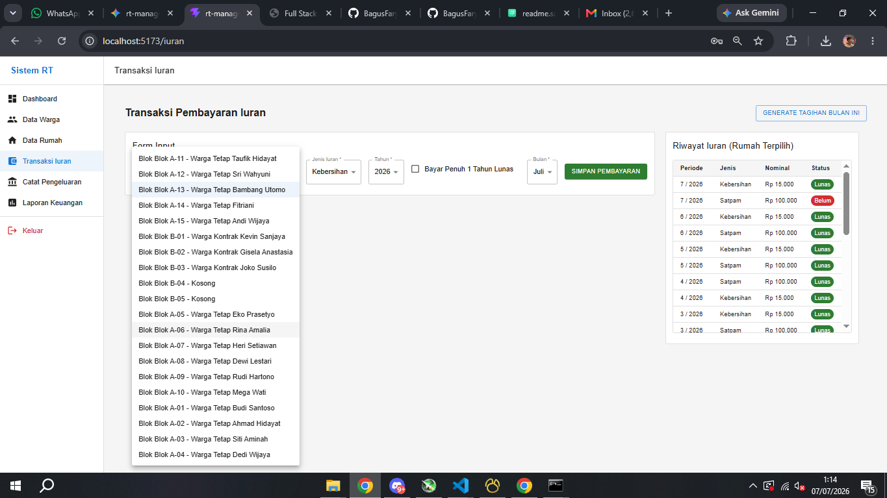 | 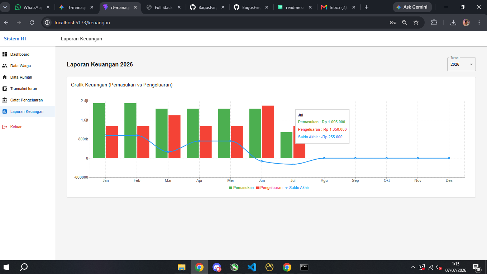 |

<details>
<summary><b>Lihat Semua Screenshot</b></summary>

| Halaman | Preview |
| :--- | :---: |
| Dashboard | 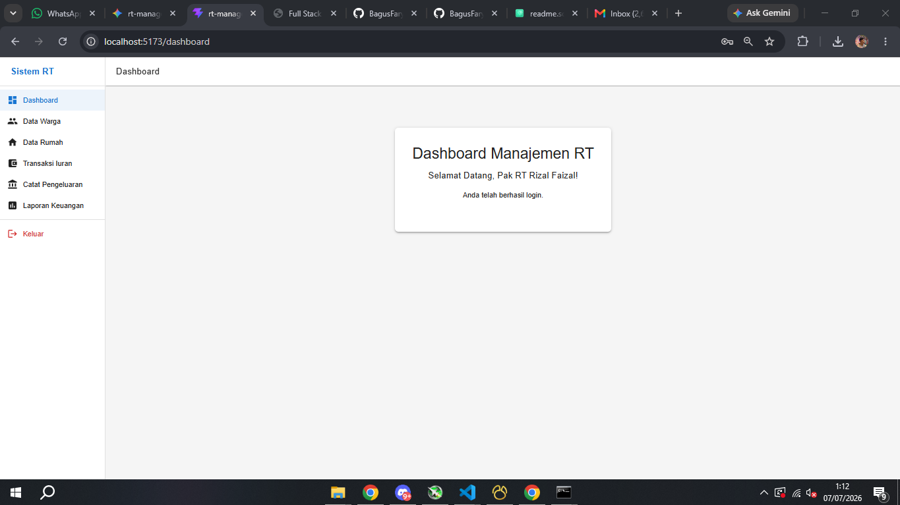 |
| Login | 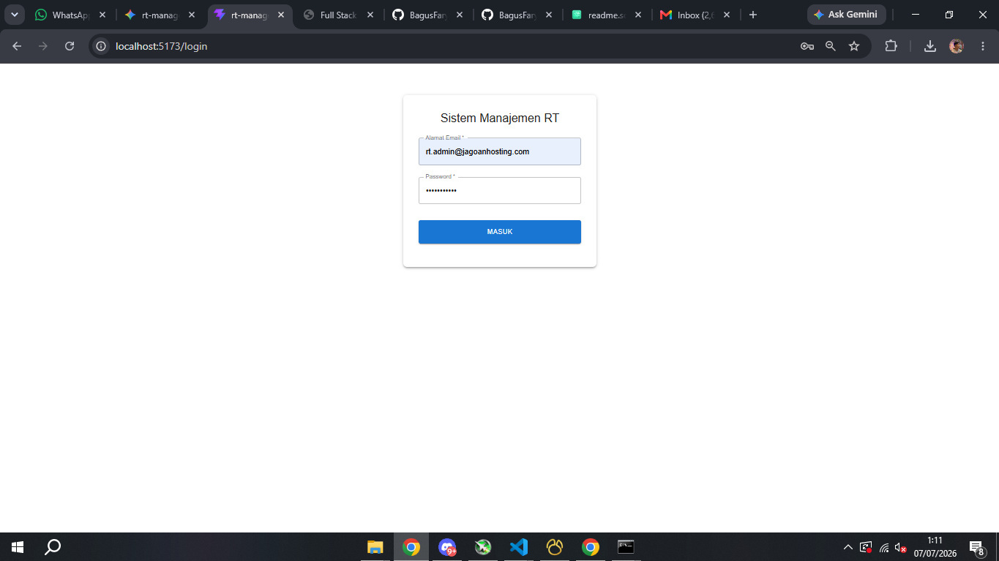 |
| Data Warga | 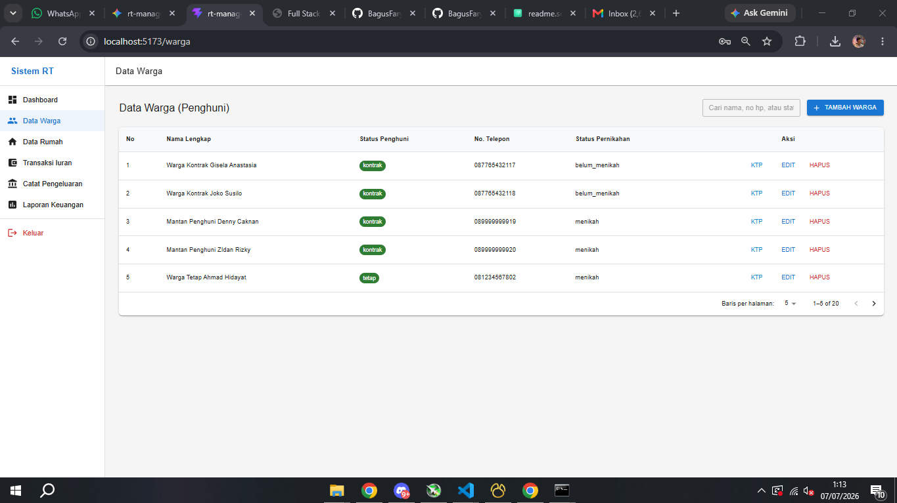 |
| Tambah Data Warga | 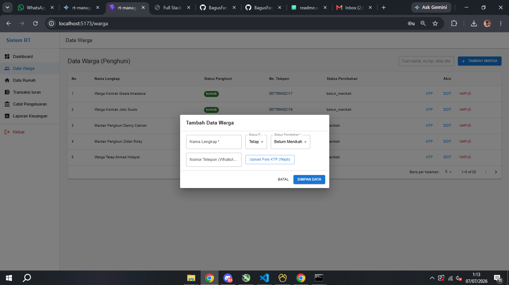 |
| Data Rumah | 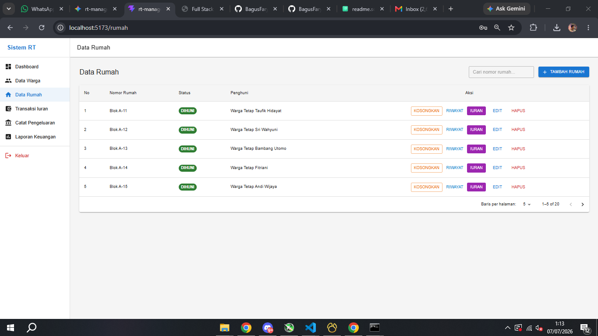 |
| Riwayat Per Rumah |  |
| Catat Pengeluaran | 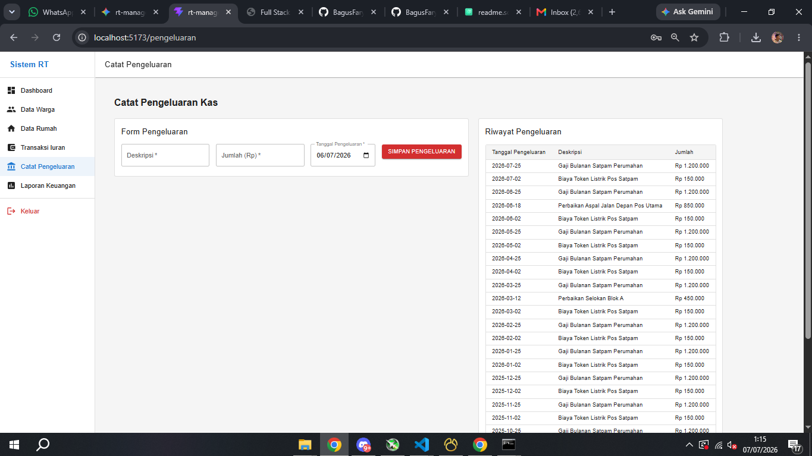 |
| Generate Tagihan | 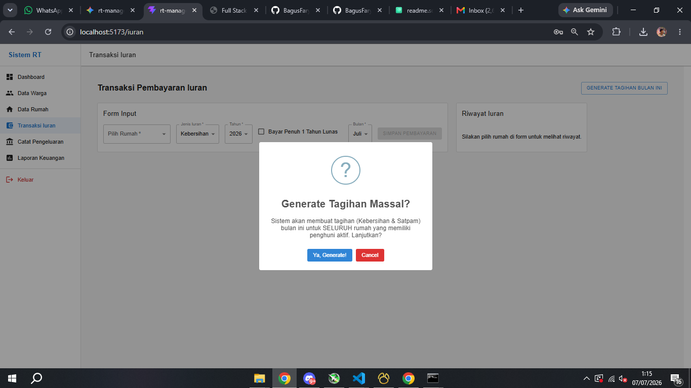 |
| Detail Laporan | 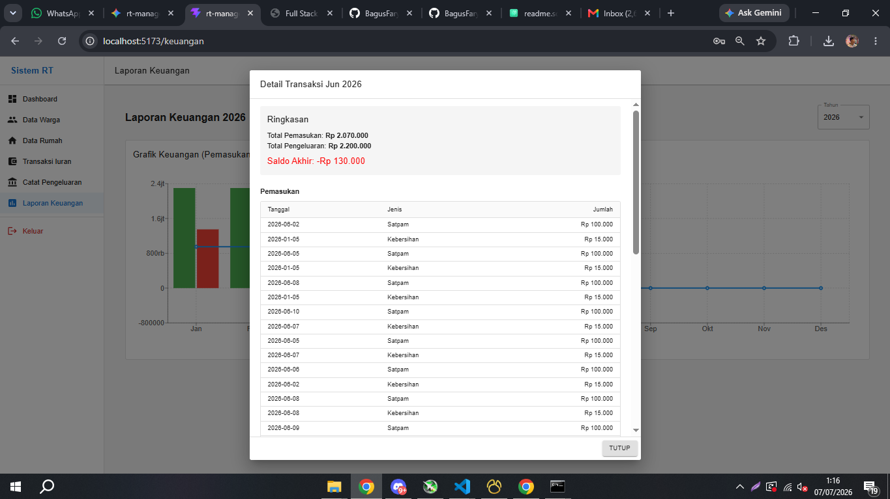 |
| History Iuran | 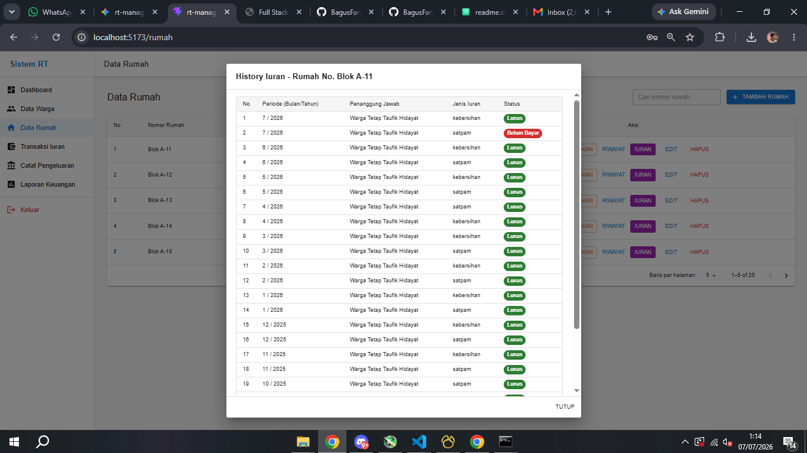 |

</details>


### 2. Setup Frontend (React.js)

Langkah-langkah untuk menyiapkan user interface:

1.  **Masuk ke Direktori Frontend**
    (Buka terminal baru agar server backend tetap berjalan)
    ```bash
    git clone https://github.com/BagusFary/rt-manajemen-frontend.git
    cd rt-manajemen-frontend
    ```

2.  **Install Dependensi Node.js**
    ```bash
    npm install
    ```

3.  **Konfigurasi Environment Variable**
    Salin file `.env.example` menjadi `.env` sesuai dengan sistem operasi/terminal yang Anda gunakan:

    *   **Linux / macOS / Git Bash / PowerShell:**
        ```bash
        cp .env.example .env
        ```
    *   **Windows Command Prompt (CMD):**
        ```cmd
        copy .env.example .env
        ```
    
    Setelah file disalin, buka file `.env` dan pastikan konfigurasi API mengarah ke URL Backend Laravel:
    ```env
    VITE_API_BASE_URL=http://127.0.0.1:8000/api
    ```

4.  **Jalankan Development Server**
    ```bash
    npm run dev
    ```
    *Aplikasi Frontend siap diakses di: `http://localhost:5173`*

---

### Kredensial Login (Admin)
Setelah menjalankan migrasi beserta seeder di backend, gunakan akun berikut untuk masuk ke sistem:

*   **Email:** `rt.admin@jagoanhosting.com`
*   **Password:** `password123`
*   **Nama Akun:** Pak RT Rizal Faizal

---

*Dokumentasi ini disusun secara profesional untuk keperluan Skill Fit Test PT. Beon Intermedia.*
